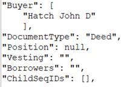
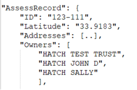

## User Story Requirement:

A name matching service is to be built that matches the Buyer names with Owner names.
This service extracts up to first 4 characters of the last name from File A (Buyer) to File B (Owners).

If there is a match, the flag is IsNameMatched is set to true.
Below is a sample scenario of 2 test files in JSON format.

1. Compile all questions regarding this logic.
2. Make your own assumptions to document a test plan with test cases, test scenarios and additional 
test data or files to perform positive, negative and edge case testing with expected IsNameMatched values.

FileA.json



FileB.json



### Questions

- Is there any limit for number of owner?
- Why there is no Longitude key in FileB.json?
- What does Address key mean in FileB.json?
- Which address belong to which owner in FileB.json?
- Even 4 digit of last name match rest could not?
- Even full last name match name might not match?
- What if owner name duplicate?

## TEST PLAN

Test Scenarios

- Verify Given Buyer file valid.
- Verify Given Owner file valid.
- Verify key and values are structured correctly for FileA.
- Verify key and values are structured correctly for FileB.
- Verify the IsNameMatched functionality.

Test Cases

- P: Verify Given Files are valid JSONs.
- P: If Given Buyer and Owner Last Name Matched then Verify IsNameMatched will be true.
- P: If Given Buyer and Owner Last Name Not Matched then Verify IsNameMatched will be false.
- N: If Given File is not valid JSON then Verify the error message.
- N: If Given File is not JSON then Verify the error message.
- N: If There is No Buyer key in File A then Verify the error message.
- N: If There are more than one Buyer in File A then Verify the error message.
- N: If Buyer data is not available in File A then Verify the error message.
- N: If There is No Owner key in File B then Verify the error message.
- N: If One or more owner data is not available in File B then Verify the error message.
- N: If Given Buyer and Owner Last Name Not Matched then Verify the error message.
- N: If Given Buyer and Owner Name Not Matched then Verify the error message.


### To run the test cases

* Install node modules
```shell
yarn 
```

* Run test cases
```shell
yarn run test
```

* Check coverage
```shell
yarn run coverage
```